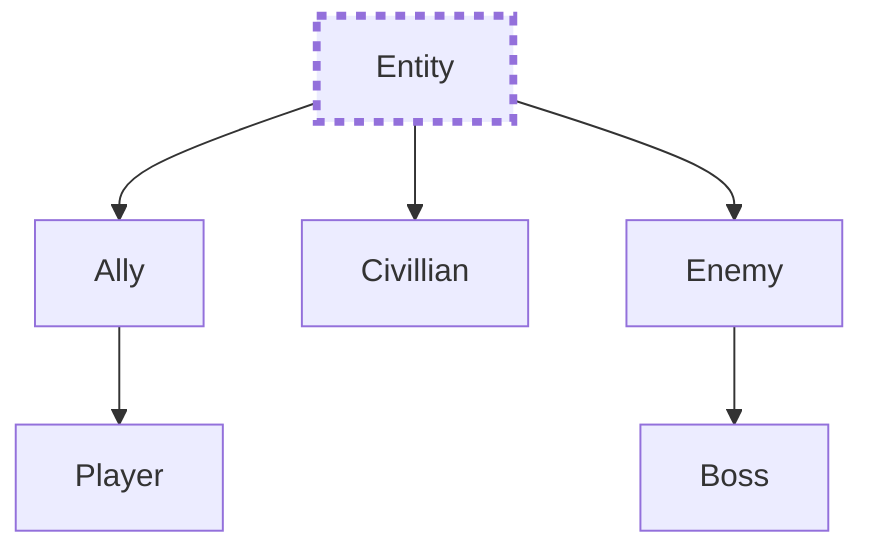
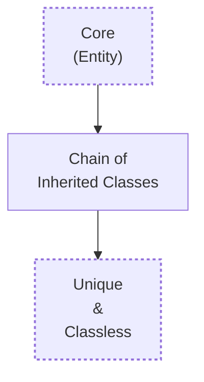

# Overview

The ECS is a complex system dependent on **Object Oriented Programming**, **Inheritance** and **Polymorphism** to ensure that core aspects of each type of Entity is properly distributed. The minimizes redundancy whilst saving a lot of time that would otherwise have been used to create code for each entity individually.

The following diagram illustrates the design of the ECS:

- The Core / Base class [[Entity]] is responsible "giving life" to an entity.
- The chain of inherited classes represent how the entire chain from [[Entity]] to the one just above the unique code for this entity. It is responsible for giving the entity an identity and determining it's behavior (such as chasing the enemy).
	- eg: if the current entity is a [[Boss]] then the chain will be: -->[[Enemy]]-->[[Boss]]-->
- The lowest stage is the classless and unique code which will apply only to the current specific entity. It is responsible for determining how the behavior (such as swinging a sword) will be carried out.

# List
- [[Entity]]
	- [[Ally]]
		- [[Player]]
	- [[Civilian]]
	- [[Enemy]]
		- [[Boss]]